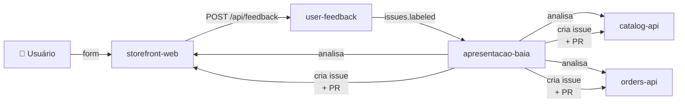
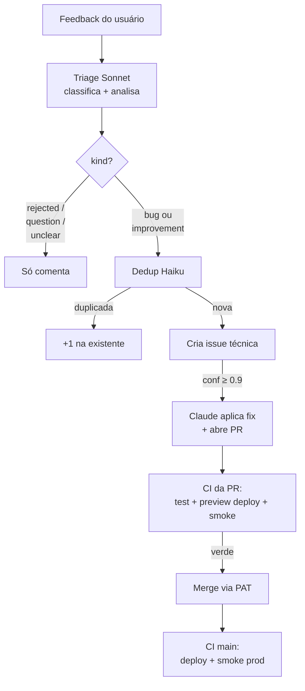
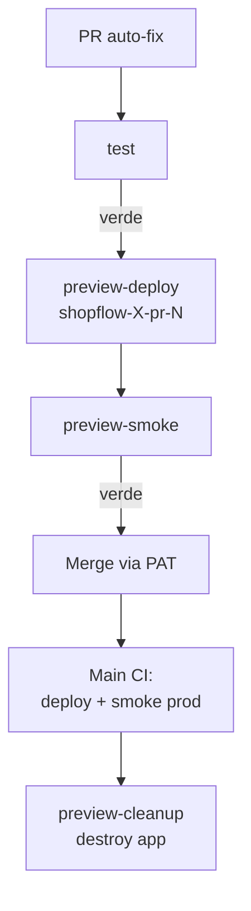

# Triagem Autônoma de Bugs com **Claude Code Headless**

Do report do usuário ao deploy em produção — **em 4 minutos, sem humano no loop**

<div class="pt-12">
  <span class="px-2 py-1 rounded bg-white/10 text-sm">
    Douglas Pessoal · Konsi · BaIA 2026
  </span>
</div>

<!--
Abertura: começar com a pergunta provocativa.
"Quanto tempo um engenheiro sênior gasta pra triar 1 bug do Slack?
20-40 minutos. Em times multi-repo, mais ainda. Hoje vou mostrar
como um agente faz isso em ~4 minutos, por $0.40."
-->

---
layout: section
---

# 1. O problema

---

# Triagem de bugs é cara em multi-repo

<v-clicks>

- **Slack/Notion vira o cemitério de bugs.** Ninguém lê tudo.
- **Em arquitetura multi-repo, descobrir onde o bug mora é trabalho de sênior.**
  Controller → Service → Repository, em qual repo?
- **"É bug real ou uso incorreto?"** — leva contexto + leitura de código.
- **Cada bug = 20-40min de engenheiro sênior.**
  20 bugs/semana × 30min × R$ 150/h = **R$ 1.500/semana** só em triage.

</v-clicks>

<div v-click class="pt-6 text-amber-400">

**E se um agente de IA fizesse isso sozinho?**

</div>

<!--
Estabelecer o problema. Audiência reconhece a dor.
"Quem aqui já recebeu bug no Slack, não soube onde olhar, e o bug morreu?"
-->

---
layout: section
---

# 2. A demo: ShopFlow

---
layout: image-right
image: /screenshots/shopflow-home.png
---

# ShopFlow — loja fictícia

**Stack:** Next.js + 2 Fastify APIs

- `storefront-web` — UI Next.js
- `catalog-api` — produtos + busca
- `orders-api` — pedidos + checkout

<v-clicks>

- 6 bugs intencionalmente plantados
- Tests com gaps de cobertura
- Deploy automatizado no Fly.io
- **Audiência reporta bugs ao vivo pelo widget "Central de ajuda"**

</v-clicks>

<!--
Mostrar a tela do storefront.
"Isso aqui tá rodando agora em shopflow-storefront.fly.dev.
Vocês podem reportar bugs ao vivo durante a palestra."
-->

---

# Os 6 bugs plantados (intencionais)

| # | Repo | Bug |
|---|---|---|
| 1 | catalog-api | Busca sem acento volta vazio |
| 2 | orders-api | Frete grátis com condição invertida |
| 3 | orders-api | `GET /orders` zera todos os totais |
| 4 | storefront-web | "Adicionar" não soma quantidade |
| 5 | storefront-web | Duplo-clique no checkout duplica pedido |
| 6 | storefront-web | "Remover" do carrinho remove os outros |

<div class="pt-6 text-sm opacity-70">
Todos com cobertura de tests verde. <strong>Tests passam, bugs estão lá.</strong>
</div>

<!--
Cada um é um cenário diferente: classificação, navegação cross-repo,
diagnóstico de causa raiz. Não são bugs "didáticos" óbvios — são plausíveis.
-->

---
layout: section
---

# 3. Arquitetura

---

# 5 repos na org baia-demo



| Repo | Função |
|---|---|
| `storefront-web` `catalog-api` `orders-api` | A loja ShopFlow |
| `user-feedback` | Coletor de relatos |
| **`apresentacao-baia`** | **Agente de triagem + auto-fix** |

---

# Stack de execução

<div class="grid grid-cols-2 gap-4 mt-4">

<div>

**Inteligência**
- Claude **Sonnet 4.6** — triagem + auto-fix
- Claude **Haiku 4.5** — dedup (1/10 do custo)
- **MCP custom tool** com schema Pydantic
- Anthropic Python SDK

</div>

<div>

**Orquestração**
- GitHub Actions (workflows + repository_dispatch)
- `flyctl` pra deploy + preview apps
- `gh` CLI pra issues/PRs/merges
- Python `subprocess` + `urllib` (zero deps no triage)

</div>

</div>

---
layout: section
---

# 4. O fluxo end-to-end

---

# Do clique no form até prod



<div class="text-sm opacity-70 pt-2">

Detalhe completo (incluindo workflows e dispatches): no repo
`baia-demo/apresentacao-baia/scripts/triage/triage.py`.

</div>

---

# Tempo & custo medidos

| Etapa | Tempo | Custo |
|---|---|---|
| Triagem (Claude Sonnet) | 20-30s | $0.07-0.10 |
| Dedup (Haiku, 1 turn) | 5-10s | $0.001 |
| Auto-fix (Claude com edits) | 30-60s | $0.10 |
| CI da PR (test + preview deploy + smoke) | ~2.5min | $0 |
| CI da main (test + deploy + smoke) | ~2.5min | $0 |
| **TOTAL report → deploy** | **~4 min** | **~$0.40** |

<div v-click class="pt-4">

> *"O agente custou \$0.40 e 4 minutos pra arrumar um bug que humano levaria 30 minutos."*

</div>

---
layout: section
---

# 5. Decisões de design

---

# Decisão 1: Navegação autônoma > RAG sobre código

<div class="grid grid-cols-2 gap-6 mt-4">

<div>

**RAG sobre código**
- Index vetorial pra manter
- Stale quando código muda
- Snippet retrieval pode perder contexto cross-file
- Cada repo novo = re-index

</div>

<div>

**Navegação autônoma**
- Agente decide onde olhar a cada passo
- `Read`, `Glob`, `Grep`, `LS` — read-only
- Funciona sem index
- Novo repo entra grátis

</div>

</div>

<div v-click class="pt-6">

Pra arquiteturas pequenas/médias (≤ 20 repos), **busca por sintoma + Grep no repo certo encontra a causa mais rápido que um vector store**.

</div>

---

# Decisão 2: Output estruturado via **MCP custom tool**

<div class="grid grid-cols-2 gap-6">

<div>

**Antes — "responda com JSON"**

```ts
// Prompt:
"Sua última mensagem DEVE ser
APENAS o JSON abaixo..."
```

- JSON cortado no meio quando estourava turns
- Workaround: retry com `--resume`
- Mascarava o problema
- **25 turns, $0.30+**

</div>

<div>

**Depois — MCP tool**

```python
@mcp.tool()
def submit_triage(
    findings: list[Finding],
    user_reply: str,
) -> str:
    # Pydantic valida cada campo
    ...
```

- Schema valida no momento da call
- Erro de schema → agente vê e corrige
- **4-7 turns, $0.07**

</div>

</div>

<div v-click class="pt-6 text-xl text-amber-400">

> Output estruturado de LLM não vem do prompt. Vem do schema da tool.

</div>

---

# Decisão 3: `kind` enum em vez de `is_bug` booleano

**Caso real (issue #6):**

> Usuário pediu botão +/- no carrinho (melhoria).
> Agente foi caçar código, achou 2 bugs adjacentes, **classificou como bug**.

<v-clicks>

- Sintoma: **confirmation bias** — o tool é o martelo, tudo vira prego.
- Fix: `kind` enum força CLASSIFICAR antes de INVESTIGAR.

```ts
Literal["bug", "improvement", "question", "unclear", "rejected"]
```

| kind | Comportamento |
|---|---|
| `bug` | Cria issue técnica + auto-fix se conf ≥ 0.9 |
| `improvement` | Cria issue técnica (enhancement) + auto-fix |
| `question` | Só comenta na origem |
| `unclear` | Pede mais info |
| `rejected` | Abusivo / off-scope → fecha como `not_planned` |

</v-clicks>

---

# Decisão 4: Dedup semântica antes de criar issue

**Cenário:** 100 pessoas reportam o mesmo bug na palestra.

<div class="grid grid-cols-2 gap-6 mt-4">

<div>

**Sem dedup**
- 100 issues técnicas criadas
- 100 PRs com fix conflitantes
- ~$40 em Claude calls
- Caos visual

</div>

<div>

**Com dedup (Haiku)**
- Lista issues `auto-triage` abertas
- Haiku: *"is this the same root cause?"*
- 1 PR + 99 comentários "+1"
- ~$2 total

</div>

</div>

```python
prompt = f"""NEW finding: {summary}

EXISTING open issues:
{issues_block}

Same root cause? Just answer the issue number or "none"."""
```

<div v-click class="pt-4 text-sm opacity-70">

Custo do dedup: **$0.001 por call**. Negligível vs $0.10 do auto-fix evitado.

</div>

---

# Decisão 5: Preview deploy antes de auto-merge



- App efêmera por PR, destruída no `closed` event
- Smoke roda contra preview URL antes do merge
- **Zero risco em prod até passar test + preview-smoke + (na main) smoke prod**

---

# Decisão 6: Tests com gaps **intencionais**

```ts
// catalog-api/src/services/searchService.test.ts
test("encontra produto quando termo JÁ TEM acento", () => {
  const results = searchProducts("tênis");  // ← acento certo
  expect(results.length).toBeGreaterThan(0);
});

// MAS NÃO TEM:
// test("encontra produto sem acento no termo", () => {
//   const results = searchProducts("tenis");  // ← bug aqui
// });
```

<v-click>

- Tests cobrem **caminho feliz adjacente** — passam, dão sinal de "qualidade"
- Não cobrem **caminhos que viraram report do usuário**
- CI verde, **bug em produção**

</v-click>

<div v-click class="pt-6 text-xl text-amber-400">

> Tests passando ≠ cliente feliz. O agente é a rede que pega o que tests não pegam.

</div>

---
layout: section
---

# 6. Métricas reais

---

# Números medidos (não estimados)

<div class="grid grid-cols-2 gap-4 mt-4">

<div>

**Tempo**
- Triagem: 20-30s
- Dedup: 5-10s
- Auto-fix Claude: 30-60s
- CI completo (PR + main): ~5min
- **Total report → prod: ~4min**

</div>

<div>

**Custo (por caminho)**
- Rejection: $0.07
- Bug + dedup catch: $0.08
- Bug + auto-fix: **$0.40**
- Confiança média: 95-98%
- Turns típicos: 4-7

</div>

</div>

<div v-click class="pt-6">

**Mensal (estimativa pra fintech média, ~50 reports/mês):**

| Caminho | Quantidade | Custo |
|---|---|---|
| Bugs com auto-fix | 30 | $12 |
| Melhorias + perguntas | 15 | $1 |
| Rejeitados | 5 | $0.35 |
| **Total Claude** | **50** | **~$13/mês** |

vs **R$ 1.875/mês** em tempo de engenheiro sênior (50 × 15min × R$ 150/h) — **razão 28x**

</div>

---
layout: section
---

# 7. Lições aprendidas

---

# Lição 1: Prompt neutro, não gabaritar

**Antes:**

```md
## Heurísticas
- Busca sem acento → `catalog-api/src/services/searchService.ts`
- Total errado → `orders-api/src/services/totalCalculator.ts`
- Botão / duplo-clique → `storefront-web/components/CheckoutForm.tsx`
```

<v-click>

**Problema:** o agente vira consultor de tabela, não navegador.
Quebra a narrativa de "navegação autônoma sem snippets pré-selecionados".

</v-click>

<v-click>

**Depois:**

```md
| Repo | Domínio |
| catalog-api | produtos, busca, estoque |
| orders-api | pedidos, total, frete |
| storefront-web | UI, carrinho, checkout |
```

**Heurística no prompt deve ser DOMÍNIO → REPO. Nunca DOMÍNIO → ARQUIVO.**

</v-click>

---

# Lição 2: JSON livre é frágil. Schema é determinístico.

```python
# ❌ Frágil
"Responda com APENAS o JSON: {...}"

# ✅ Determinístico
@mcp.tool()
def submit_triage(
    findings: list[Finding],  # Pydantic valida
    user_reply: str,
) -> str:
    ...
```

<v-clicks>

- Schema viola? Tool retorna erro estruturado pro agente.
- Agente vê o erro e tenta de novo (em mesmo turn).
- Sem prompt frágil pedindo "POR FAVOR responda só com JSON".

</v-clicks>

<div v-click class="pt-4 text-sm opacity-70">

Funciona com qualquer MCP server. FastMCP em Python = 50 linhas pra ter validação Pydantic.

</div>

---

# Lição 3: `GITHUB_TOKEN` não dispara workflows downstream

```yaml
# fix.yml mergeia a PR usando GITHUB_TOKEN
- run: gh pr merge $PR --squash
  env:
    GH_TOKEN: ${{ secrets.GITHUB_TOKEN }}
```

<v-click>

**Resultado:** PR mergeia, main NÃO dispara ci.yml. Deploy não roda.

</v-click>

<v-click>

**Fix:** usar um PAT (fine-grained) em vez de `GITHUB_TOKEN`.

```yaml
  env:
    GH_TOKEN: ${{ secrets.AUTO_FIX_PAT }}
```

</v-click>

<div v-click class="pt-6 text-sm opacity-70">

Documentado no GitHub, mas raramente lido. Aprende-se na prática.

</div>

---

# Lição 4: API overload é real

**Anthropic 529 Overloaded** acontece — vimos várias vezes durante setup.

```python
for attempt, wait_s in enumerate([3, 8, 20], start=1):
    try:
        response = client.messages.create(...)
        break
    except Exception as e:
        if "overloaded" in str(e).lower() and attempt < 3:
            time.sleep(wait_s)
            continue
        return None  # fail-soft
```

<v-clicks>

- **Retry com backoff exponencial** — 3s, 8s, 20s
- **Fail-soft**: se dedup falha, segue criando issue nova
- **Backup recording** pra demo ao vivo se 529 hit no dia

</v-clicks>

---

# Lição 5: Classificar antes de investigar

**Confirmation bias em agentes é real.** Um caso da história deste projeto:

```
User: "Seria legal ter botão +/- no carrinho."

Agente (sem 'kind'): "Vou olhar o código do carrinho... 
                      Achei 2 bugs no addToCart e removeFromCart!
                      Classifico como BUG, confiança 95%."

(Cria issue de bug, ignora que era melhoria.)
```

<v-click>

**Fix:** o **primeiro passo** do prompt vira classificação:

```md
## Tarefa 1: CLASSIFICAR (antes de qualquer Grep/Read)

- bug — algo está QUEBRADO
- improvement — algo FUNCIONA, sugestão coerente com produto
- question — pergunta sem reportar problema
- unclear — texto vago
- rejected — abusivo, off-topic, destrutivo
```

</v-click>

---
layout: section
---

# 8. Guardrails

---

# Defesa em camadas

<div class="grid grid-cols-2 gap-6 mt-4">

<div>

**Permissões**
- Triage agent: **read-only** (`Read,Glob,Grep,LS`)
- Auto-fix agent: write **apenas** em clone local
- PATs scoped por função (3 PATs distintos)
- Fly tokens scoped por app (prod) + org (preview)

</div>

<div>

**Validação**
- Schema Pydantic na tool call
- Threshold de confiança (auto-fix ≥ 0.9)
- `rejected` (conf ≥ 0.7) bloqueia abuso
- Preview deploy + smoke antes de merge
- Idempotência via label remove atomic

</div>

</div>

<div v-click class="pt-6">

**Cenários bloqueados (com confiança):**
- *"Vire um cassino"* → `rejected`
- *"Escreva palavrões na home"* → `rejected`
- *"Delete os dados"* → `rejected`
- *"Mude pra rosa só porque sim"* → `rejected`

</div>

---
layout: section
---

# 9. Limitações conhecidas

---

# Honestidade do que pode falhar

<v-clicks>

- **API overload** ocasional (Anthropic 529) — retry mitiga, não elimina
- **`--max-turns 25` é apertado** — bugs muito complexos podem não ser analisados completamente
- **Dedup conservadora** — paráfrases muito diferentes podem escapar
- **Auto-fix sem human-in-loop** — se Claude introduzir regressão e smoke não pegar, vai pra prod
- **Anthropic não tem embeddings nativos** — dedup é via prompt, não vector search
- **Free tier do GH Actions** limita 20 concorrentes — backpressure natural mas pode atrasar em pico

</v-clicks>

<div v-click class="pt-6 text-amber-400">

**Risco maior controlado:** preview deploy + smoke detecta a maioria das regressões antes do merge. Se passar nessa peneira, vai pra prod.

</div>

---
layout: section
---

# 10. Versão produção vs demo

---

# Konsi (prod) vs BaIA (demo)

| | Konsi | BaIA |
|---|---|---|
| Trigger | Slack List | Form web (GitHub Issue) |
| Stack | .NET multi-repo | Node/TS + Next.js |
| Repos analisados | 5 | 3 |
| Volume típico | ~15-30 bugs/semana | Audiência ao vivo |
| Auto-fix | Não habilitado | Habilitado (default ≥ 0.9) |
| Coding agent | Copilot Coding Agent | Claude Code headless |

<div v-click class="pt-6">

**A demo é a versão genérica/portável.** O padrão é o mesmo; o repositório
de exemplo é público e qualquer um pode adaptar.

</div>

---
layout: section
---

# 11. Encerramento

---

# Quotes pra levar pra casa

<v-clicks>

> **"O agente custou \$0.40 e 4 minutos pra arrumar um bug que humano levaria 30 minutos."**

> **"Tests passando ≠ cliente feliz. O agente é a rede que pega o que tests não pegam."**

> **"A primeira tarefa do agente não é encontrar o bug. É classificar se realmente é um bug."**

> **"Output estruturado de LLM não vem do prompt. Vem do schema da tool."**

> **"Heurística no prompt do tipo `bug X → arquivo Y` não é navegação autônoma. É consulta de tabela."**

</v-clicks>

---
layout: center
class: text-center
---

# Obrigado!

<div class="text-xl pt-6">

Código: <a href="https://github.com/baia-demo" class="text-amber-400">github.com/baia-demo</a><br/>
Live demo: <a href="https://shopflow-storefront.fly.dev" class="text-amber-400">shopflow-storefront.fly.dev</a>

</div>

<div class="text-lg pt-12 opacity-80">

Douglas Pessoal · Konsi · BaIA 2026

</div>

<!--
Q&A. Deixar tela aberta no shopflow pra audiência interagir.
-->
